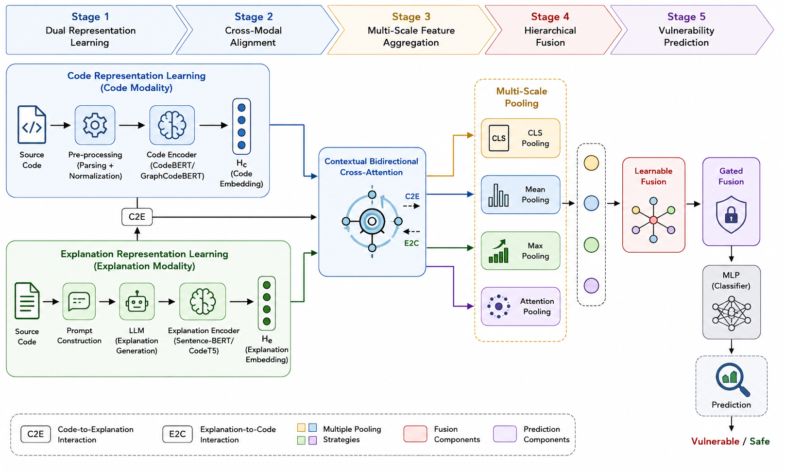

# BiCEVul: Bidirectional Cross-Attention Fusion of Code and LLM-Generated Explanations for Software Vulnerability Detection

This repository contains the official implementation of **BiCEVul**, a multimodal vulnerability detection framework that performs hierarchical cross-modal representation learning through bidirectional cross-attention and adaptive multi-scale pooling.



## Overview

Existing multimodal vulnerability detection methods typically employ symmetric feature fusion and fixed pooling strategies that cannot fully exploit complementary information across code and natural-language modalities. BiCEVul addresses this by:

- **Bidirectional Cross-Attention with Alpha Gating**: explicitly models the asymmetric, directional relationship between source code and LLM-generated explanation representations in both Code-to-Explanation (C2E) and Explanation-to-Code (E2C) directions, with learnable scalar gates controlling cross-modal context.
- **Sigmoid-Gated Adaptive Multi-Scale Pooling**: adaptively selects informative representations from multiple pooling strategies per stream.
- **Hierarchical Fusion**: integrates code, explanation, and cross-attended streams into a unified representation for classification.

BiCEVul achieves state-of-the-art AUC of 0.646 on Devign and 0.962 on TrVD, and remains the strongest configuration among all evaluated modality variants on Reveal.

## Repository Structure

```
BiCEVul/
├── code/             # Model implementation, training, and evaluation scripts
├── data/             # Dataset access instructions (see below)
├── figures/          # Architecture diagrams and graphical abstract
├── docs/             # Supplementary documentation
└── README.md
```

## Datasets

Experiments are conducted on three public benchmark datasets: Devign, Reveal, and TrVD, using the publicly available LLM-augmented versions.

Datasets are available at: [Google Drive link](https://drive.google.com/file/d/1EU3wztfOpmbQdvZoMDAqtnvSEmLT1iL9/view?usp=sharing)

Download and place the data under `data/` following the structure described in `data/README.md`.

## Installation

```bash
git clone https://github.com/ShamaSharma/BiCEVul.git
cd BiCEVul
pip install -r requirements.txt
```

## Usage

Training and evaluation scripts are provided under `code/`. See `code/README.md` for detailed instructions on running each model family (ML, DL, Transformer, and LLM-based baselines) and the full BiCEVul architecture.

## Citation

If you use this code or find this work useful, please cite:

```bibtex
@article{bicevul,
  title={Bidirectional Cross-Attention Fusion of Code and LLM-Generated Explanations for Software Vulnerability Detection},
  author={Shama,Sarika},
  journal={Information Fusion},
  year={2026}
}
```

## License

This project is released under the MIT License. See [LICENSE](LICENSE) for details.

## Contact

For questions, please open an issue on this repository.
